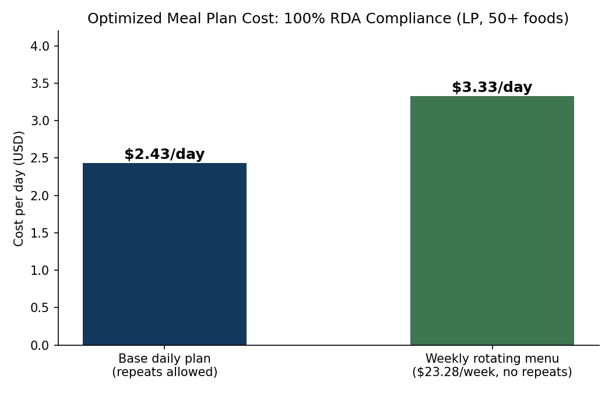

# Nutrition Planning Optimization (Linear Programming)

Four-stage linear programming framework for institutional (school lunch) meal planning across **50+ food items**, balancing full nutritional compliance against cost and menu variety.

## Problem

Design a meal plan that meets 100% of Recommended Daily Allowance (RDA) nutritional requirements at minimum cost, then extend it to a realistic weekly menu where no meal repeats.

## Method

Four progressive LP formulations (solved with Gurobi):

1. Minimum-cost daily plan meeting all RDA constraints
2. Refinements adding practical serving-size and food-group constraints
3. Palatability constraints on portion composition
4. Weekly plan: 7-day rotating menu with no repeated meals

## Results

- Base model: **$2.43 per day** at 100% RDA compliance
- Final weekly model: **$23.28 per week** for a 7-day rotating, no-repeat menu (about $3.33/day, quantifying the cost of menu variety)

## Tech Stack

Python, Gurobi (gurobipy), linear programming, pandas

---

_Part of my portfolio: [haiiibin.github.io](https://haiiibin.github.io)_
